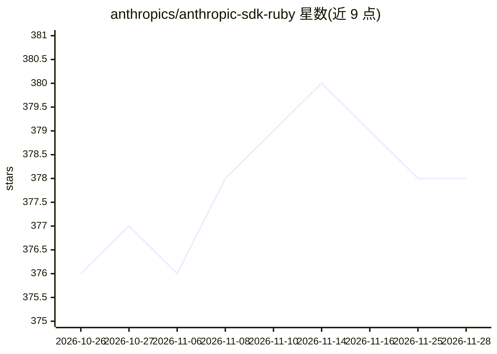

# anthropics/anthropic-sdk-ruby

⭐ 378 · Ruby · Apache-2.0 · 推送 2026-11-24 · [GitHub](https://github.com/anthropics/anthropic-sdk-ruby) · 组织维护

**Ruby 应用接入 Claude API 的官方 SDK**

Anthropic 官方 Ruby SDK，通过 Claude API 在 Ruby 应用中调用 Claude 模型。安装方式为在 Gemfile 中添加 gem 依赖（当前版本 2.14.0），要求 Ruby 3.2.0 及以上。README 提供 getting started 示例代码，完整文档托管于 platform.claude.com。项目采用 Apache 2.0 许可，此前的版本及早期第三方贡献仍保留 MIT 许可。

## 筛选速览

| 维度 | 判定 | 备注 |
|---|---|---|
| AI 角色 | `ai-ecosystem` | LLM/agent 周边工具 |
| 许可风险 | `permissive` | Apache-2.0 |
| 部署形态 | `None` |  |
| 模型依赖 | locked-api |  |
| 硬件要求 | — | 无带数字的原话,不猜 |
| 安装摩擦 | `low` | 无编译、无系统依赖或容器化 |
| 成熟度 | — | 结构信号不足 |

## 能力要点

- 官方维护的 Claude API Ruby 接入 SDK
- 通过 Gemfile/gem 安装，版本 2.14.0
- 要求 Ruby 3.2.0+
- Apache 2.0 许可，旧版本保留 MIT 许可

## 适用场景

- 在 Ruby 应用中调用 Claude API
- 为 Ruby 项目接入 Claude 模型能力

## 场景标签

 · 领域:LLM 基础设施/SDK

## 证据(README 行号)

> L5: The Anthropic SDK for Ruby provides access to the Claude API from Ruby applications.
> L11: ## Installation

## 星数曲线

```mermaid
xychart-beta
    title "anthropics/anthropic-sdk-ruby 星数(近 9 点)"
    x-axis ["2026-10-26", "2026-10-27", "2026-11-06", "2026-11-08", "2026-11-10", "2026-11-14", "2026-11-16", "2026-11-25", "2026-11-28"]
    y-axis "stars" 375 --> 381
    line [376, 377, 376, 378, 379, 380, 379, 378, 378]
```

2026-10-26 376 → 2026-11-28 378（+2）

---
*卡片 v1 · prompt 1.4 · 生成 2026-11-26 · 置信度 high · 依据 README sha `db958a7e5eec` · [字段定义](../../DATASET.md)*
