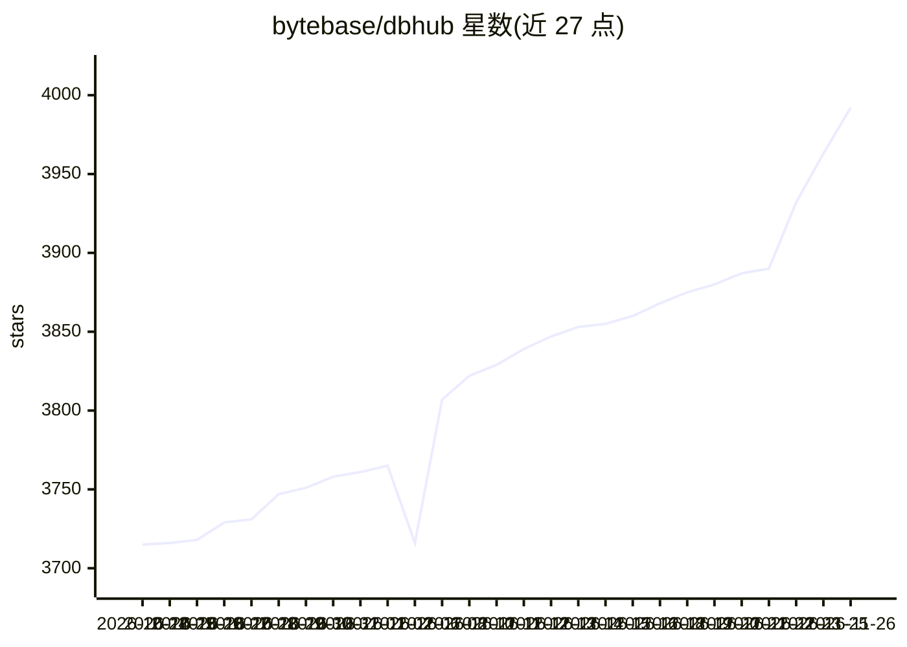

# bytebase/dbhub

⭐ 3,992 · TypeScript · MIT · 推送 2026-11-25 · [GitHub](https://github.com/bytebase/dbhub) · [官网](https://dbhub.ai) · 组织维护

**面向 MCP 客户端的多数据库 MCP 服务器**

DBHub 是一个 MCP 服务器，让 Claude Desktop、Claude Code、VS Code、Cursor 等 MCP 兼容客户端连接并探索多种数据库，支持 PostgreSQL、MySQL、MariaDB、SQL Server、Oracle、ClickHouse 和 SQLite。默认提供 execute_sql 与 search_objects 两个工具，另有 opt-in 工具与自定义工具；内置只读模式、行数限制、查询超时等防护，支持 SSH 隧道与 TLS。通过 npx、Claude Code/Codex 插件、Docker 镜像或 MCP Bundle 分发，开发需 Node.js >= 22.5.0。

## 筛选速览

| 维度 | 判定 | 备注 |
|---|---|---|
| AI 角色 | `ai-ecosystem` | LLM/agent 周边工具 |
| 许可风险 | `permissive` | MIT |
| 部署形态 | `library` | 以包/库形式分发 |
| 模型依赖 | — | README 未给出锁定关系 |
| 硬件要求 | — | 无带数字的原话,不猜 |
| 安装摩擦 | `low` | 无编译、无系统依赖或容器化 |
| 成熟度 | — | 结构信号不足 |

## 能力要点

- 单一进程连接 PostgreSQL/MySQL/MariaDB/SQL Server/Oracle/ClickHouse/SQLite
- 默认仅 2 个 MCP 工具，定义共 261 tokens，节省上下文窗口
- 只读模式、行数限制、查询超时等防护机制
- 内置 Workbench Web 界面，无需 MCP 客户端即可操作

## 适用场景

- 在 Claude Code/Cursor 中探索 schema、验证查询、调试数据
- 向非技术人员提供只读的数据视图访问
- 用单一 DBHub 进程替代每库一个的 MCP 服务器
- 生产环境只读诊断并防止失控查询

## 场景标签

`数据分析` · 领域:效率与自动化

## 证据(README 行号)

> L19: DBHub is a minimal MCP server: token-efficient, zero-dependency, and just two tools by default with opt-in extras. 
> L22: - **Multi-Database**: PostgreSQL, MySQL, MariaDB, SQL Server, Oracle, ClickHouse, and SQLite through a single inter
> L43: - **Local Development**: Schema exploration, query validation, and data debugging with Claude Code, VS Code, Cursor

## 星数曲线

```mermaid
xychart-beta
    title "bytebase/dbhub 星数(近 27 点)"
    x-axis ["2026-10-24", "2026-10-25", "2026-10-26", "2026-10-27", "2026-10-28", "2026-10-29", "2026-10-30", "2026-10-31", "2026-11-01", "2026-11-02", "2026-11-06", "2026-11-08", "2026-11-10", "2026-11-11", "2026-11-12", "2026-11-13", "2026-11-14", "2026-11-15", "2026-11-16", "2026-11-18", "2026-11-19", "2026-11-20", "2026-11-21", "2026-11-22", "2026-11-23", "2026-11-25", "2026-11-26"]
    y-axis "stars" 3688 --> 4019
    line [3715, 3716, 3718, 3729, 3731, 3747, 3751, 3758, 3761, 3765, 3716, 3807, 3822, 3829, 3839, 3847, 3853, 3855, 3860, 3868, 3875, 3880, 3887, 3890, 3932, 3963, 3992]
```

2026-10-24 3,715 → 2026-11-26 3,992（+277）

---
*卡片 v1 · prompt 1.4 · 生成 2026-11-23 · 置信度 high · 依据 README sha `ae5a08ecdc28` · [字段定义](../../DATASET.md)*
