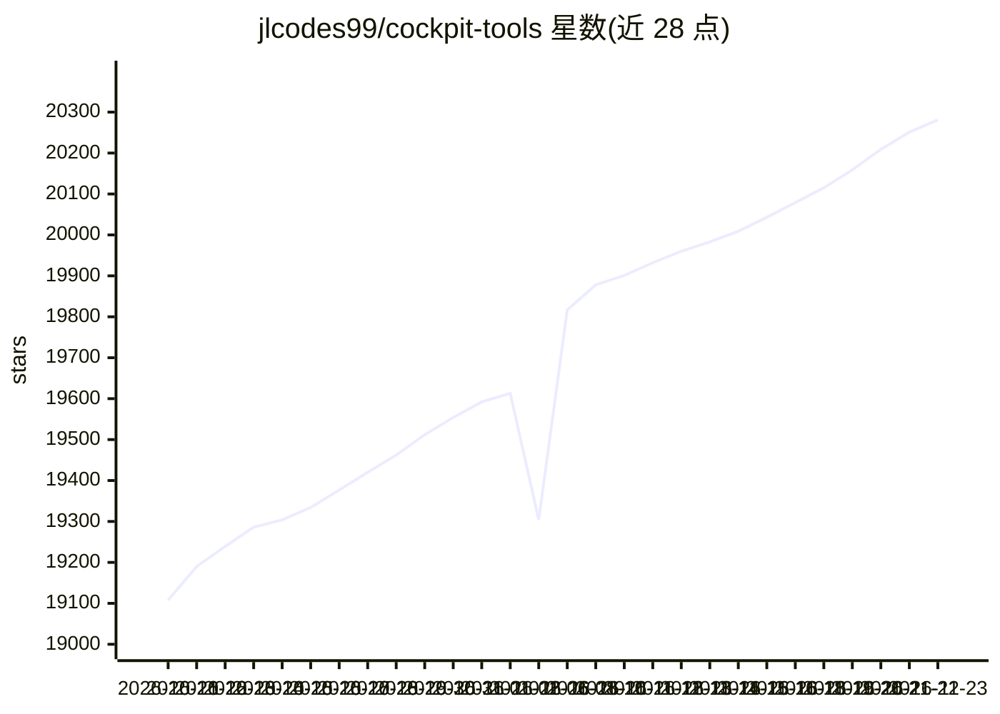

# jlcodes99/cockpit-tools

⭐ 20,281 · Rust · 推送 2026-11-22 · [GitHub](https://github.com/jlcodes99/cockpit-tools) · [官网](https://github.com/jlcodes99/cockpit-tools#readme) · 个人维护 · 中文 README

**管理多款 AI IDE 账号的桌面工具：切号、配额监控、多开**

本地桌面工具，统一管理 Antigravity、Codex、GitHub Copilot、Windsurf、Kiro、Cursor、Grok CLI、CodeBuddy、Qoder、Trae、Zed、ZCode 等 AI IDE/CLI 的账号：支持 OAuth/Token/JSON 导入、一键切号注入并启动客户端、多账号多实例并行运行、配额与套餐展示、定时唤醒任务。内置 Rust 引擎的 API 服务兼容 Responses/Chat Completions/Claude/Gemini/Ollama 协议，可接管 Codex 的模型请求与转写路由。数据保存在本机目录，无需注册平台账号。提供 macOS/Windows/Linux 平台支持与 18 种语言界面。

## 筛选速览

| 维度 | 判定 | 备注 |
|---|---|---|
| AI 角色 | `ai-ecosystem` | LLM/agent 周边工具 |
| 许可风险 | `none` | — |
| 部署形态 | `desktop` | 安装包/桌面程序 |
| 模型依赖 | local-ok | 支持本地模型 |
| 硬件要求 | — | 无带数字的原话,不猜 |
| 安装摩擦 | `low` | 无编译、无系统依赖或容器化 |
| 成熟度 | — | 结构信号不足 |

## 动量与使用信号

- 维护:`active` — 距上次 push 0.8 天,年发版 100,78 位贡献者
- 涨星:近 1 天 **+33**(自 20261016 起算)
- 平台:WINDOWS / MACOS / LINUX · 协议:MCP / OLLAMA

## 能力要点

- 16+ 平台的账号导入、切号注入与启动管理
- 多账号多实例并行运行，实例目录与参数隔离
- 配额监控仪表盘与定时唤醒任务
- 内置 Rust API 服务，兼容多种模型协议与语音转写入口

## 适用场景

- 同时使用多个 AI IDE 账号并快速切换
- 多开 IDE 实例分别绑定不同账号处理不同项目
- 查看各平台配额余量、重置时间与订阅套餐

## 场景标签

 · 领域:开发者工具/AI 工具管理

## 证据(README 行号)

> L10: 一款**通用的 AI IDE 账号管理工具**，目前支持 **Antigravity IDE**、**Codex**、**GitHub Copilot**、**Windsurf**、**Kiro**、**Cursor**、**Gr
> L12: > 本工具旨在帮助用户高效管理多个 AI IDE 账号，支持一键切换、配额监控、自动唤醒与应用多开并行运行，助您充分利用不同账号的资源。
> L86: - **API 服务**：统一由宿主内的 Rust 引擎运行，支持 Responses HTTP/SSE/WebSocket、上下文压缩及 Chat Completions、Claude、Gemini、Ollama 协议兼容。旧 

## 星数曲线

```mermaid
xychart-beta
    title "jlcodes99/cockpit-tools 星数(近 28 点)"
    x-axis ["2026-10-21", "2026-10-22", "2026-10-23", "2026-10-24", "2026-10-25", "2026-10-26", "2026-10-27", "2026-10-28", "2026-10-29", "2026-10-30", "2026-10-31", "2026-11-01", "2026-11-02", "2026-11-06", "2026-11-08", "2026-11-10", "2026-11-11", "2026-11-12", "2026-11-13", "2026-11-14", "2026-11-15", "2026-11-16", "2026-11-18", "2026-11-19", "2026-11-20", "2026-11-21", "2026-11-22", "2026-11-23"]
    y-axis "stars" 18991 --> 20398
    line [19108, 19190, 19239, 19286, 19304, 19334, 19377, 19420, 19462, 19512, 19554, 19592, 19613, 19304, 19817, 19878, 19901, 19932, 19960, 19983, 20009, 20043, 20079, 20115, 20159, 20209, 20251, 20281]
```

2026-10-21 19,108 → 2026-11-23 20,281（+1,173）

---
*卡片 v1 · prompt 1.4 · 生成 2026-11-22 · 置信度 mid · 依据 README sha `45466f9b8e9f` · [字段定义](../../DATASET.md)*
