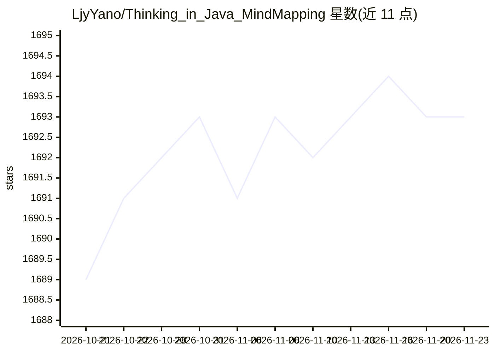

# LjyYano/Thinking_in_Java_MindMapping

⭐ 1,693 · Python · NOASSERTION · 推送 2026-11-09 · [GitHub](https://github.com/LjyYano/Thinking_in_Java_MindMapping) · [官网](https://yano-nankai.notion.site/Yano-Space-ff42bde7acd1467eb3ae63dc0d4a9f8c) · 个人维护 · 中文 README

**个人技术知识库：Java/Agent 笔记与思维导图**

始于 2017 年《Java 编程思想》思维导图、后发展为个人知识库的仓库：内容覆盖 Java/JVM、Redis、Spring、Netty 等后端技术笔记，Agent/MCP、RAG、模型评测等 AI 工程实践文章，以及读书、观影、游戏和生活记录。仓库内含 Netty.xmind 与 On Java.xmind 思维导图原文件，文章列表由 INDEX.md 自动生成并按主题分类；作者另维护拾遗周刊与面向 AI 编程助手的 skill-pack 项目。

## 筛选速览

| 维度 | 判定 | 备注 |
|---|---|---|
| AI 角色 | `ai-knowledge` | 知识聚合/清单类 |
| 许可风险 | `none` | NOASSERTION |
| 部署形态 | `None` |  |
| 模型依赖 | — | README 未给出锁定关系 |
| 硬件要求 | — | 无带数字的原话,不猜 |
| 安装摩擦 | `low` | 无编译、无系统依赖或容器化 |
| 成熟度 | `idea` | |

## 能力要点

- 《Java 编程思想》思维导图及 Netty、On Java 原文件
- Agent 原理、MCP 原理及 Java 开发指南等 AI 工程文章
- INDEX.md 自动生成的按主题分类文章导航
- 延伸项目 skill-pack：面向 Claude Code、Codex CLI 的可复用 Skills 集合

## 适用场景

- 查阅 JVM、Redis、Netty 等后端技术原理笔记
- 学习 Agent 与 MCP 的 Java 开发实践
- 下载思维导图原文件辅助技术学习

## 场景标签

`教程课程` · 领域:学习与行业

## 证据(README 行号)

> L13: 这个仓库始于 2017 年整理《Java 编程思想》的思维导图，后来逐渐发展为个人知识库：包括 Java、Redis、Spring 等后端技术，AI / Agent 工程实践，以及读书、游戏和生活记录。
> L24: |AI / Agent|Agent 原理 · MCP 原理及 Java 开发指南|

## 星数曲线

```mermaid
xychart-beta
    title "LjyYano/Thinking_in_Java_MindMapping 星数(近 11 点)"
    x-axis ["2026-10-21", "2026-10-22", "2026-10-28", "2026-10-31", "2026-11-06", "2026-11-08", "2026-11-10", "2026-11-13", "2026-11-16", "2026-11-20", "2026-11-23"]
    y-axis "stars" 1688 --> 1695
    line [1689, 1691, 1692, 1693, 1691, 1693, 1692, 1693, 1694, 1693, 1693]
```

2026-10-21 1,689 → 2026-11-23 1,693（+4）

---
*卡片 v1 · prompt 1.4 · 生成 2026-11-23 · 置信度 high · 依据 README sha `e102156dbf75` · [字段定义](../../DATASET.md)*
