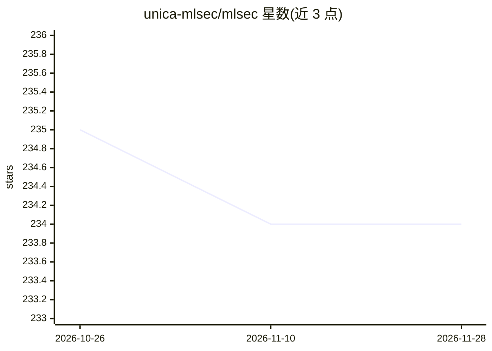

# unica-mlsec/mlsec

⭐ 234 · Jupyter Notebook · 推送 2026-11-27 · [GitHub](https://github.com/unica-mlsec/mlsec) · [官网](https://unica-mlsec.github.io/mlsec/) · 组织维护

**卡利亚里大学机器学习安全课程资料库：攻击、防御与评测**

卡利亚里大学面向硕士与博士项目的机器学习安全课程（2026-2027 学年）的官方资料仓库，由 Battista Biggio 教授主讲。内容覆盖威胁建模、规避攻击、认证防御、投毒攻击、隐私攻击、可解释 AI、LLM 安全与 AI Agent 等专题。考核包括阅读小组报告/口试与 Python 项目两部分，学生需用 Python 在基准数据集上实现并测试鲁棒机器学习模型。仓库用于发布讲义等课程材料。

## 筛选速览

| 维度 | 判定 | 备注 |
|---|---|---|
| AI 角色 | `ai-knowledge` | 知识聚合/清单类 |
| 许可风险 | `none` | — |
| 部署形态 | `None` |  |
| 模型依赖 | — | README 未给出锁定关系 |
| 硬件要求 | — | 无带数字的原话,不猜 |
| 安装摩擦 | `low` | 无编译、无系统依赖或容器化 |
| 成熟度 | — | 结构信号不足 |

## 能力要点

- 覆盖威胁建模、规避/投毒/隐私攻击与防御的课程体系
- 包含 LLM 安全与 AI Agent 专题讲座
- 考核含 Python 项目与阅读小组/口试

## 适用场景

- 学习对抗机器学习的基础概念与方法
- 按课程讲义自学机器学习安全专题
- 参考课程考核形式设计 ML 安全练习

## 场景标签

`教程课程` · 领域:学习与行业

## 证据(README 行号)

> L11: **MSc in Computer Engineering, Cybersecurity and Artificial Intelligence (Univ. Cagliari)**
> L27: The objective of this course is to provide students
> L47: 1. Introduction to the course

## 星数曲线

```mermaid
xychart-beta
    title "unica-mlsec/mlsec 星数(近 3 点)"
    x-axis ["2026-10-26", "2026-11-10", "2026-11-28"]
    y-axis "stars" 233 --> 236
    line [235, 234, 234]
```

2026-10-26 235 → 2026-11-28 234（-1）

---
*卡片 v1 · prompt 1.4 · 生成 2026-11-28 · 置信度 high · 依据 README sha `282a5d42a388` · [字段定义](../../DATASET.md)*
